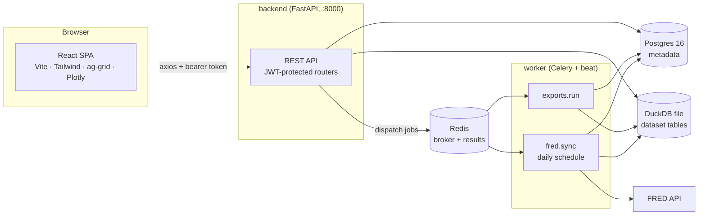

# Architecture

## System overview



Two data stores with a hard split of responsibilities:

- **Postgres** holds *metadata*: dataset registry (name, schema, provenance,
  status), export jobs, users. Accessed async (asyncpg) from FastAPI and sync
  (psycopg) from Alembic and the Celery worker.
- **DuckDB** (single file on a shared volume) holds *the data*: one table per
  dataset (`ds_<id>` for uploads/materializations, `fred_<series>` for FRED).
  All analytics — preview, SQL explore, pipeline execution, chart aggregation,
  profiling — run as DuckDB SQL so raw rows never ship to the browser
  unnecessarily.

## Request path for each module

| Module | Endpoint | How it uses DuckDB |
|---|---|---|
| Ingestion | `POST /api/datasets` | `read_csv_auto` / `read_json_auto` / `read_parquet` / pandas (Excel) → `CREATE TABLE ds_<id>` |
| Preview/Grid | `GET /api/datasets/{id}/preview` | `SELECT … ORDER BY <validated col> LIMIT ? OFFSET ?` (ag-grid infinite row model) |
| Explore | `POST /api/explore/query` | read-only connection + read-statement allowlist |
| Studio | `POST /api/studio/{preview,materialize}` | declarative steps compiled to a CTE chain (`s0…sN`); materialize = `CREATE TABLE … AS` |
| Profiling | `GET /api/datasets/{id}/profile` | `SUMMARIZE` + histogram/top-k queries |
| Charts | `POST /api/viz/data` | `GROUP BY` pushed down; identifiers strictly validated |
| Stats | `POST /api/stats/*` | column pull into pandas → scipy/statsmodels/prophet |
| Exports | `POST /api/exports` | worker: `COPY (…) TO file` (csv/parquet) or pandas (xlsx) |

## Concurrency model for DuckDB

DuckDB allows one read-write process **or** many read-only processes.

- Inside the backend process, all access is serialized behind a lock
  (`app/services/ingestion.py`) and connections are short-lived.
- Reads (explore, preview, profile, viz, stats) use `read_only=True`
  connections — a crash or concurrent ingest cannot corrupt the file.
- The worker (exports read, FRED write) opens its own connections with a small
  retry loop to ride out the backend's transient write windows.

This is a deliberate single-node dev-scale design; a multi-writer deployment
would swap the DuckDB file for MotherDuck/object-storage parquet or per-dataset
files.

## Security posture

- JWT bearer auth (fastapi-users); every data router is protected centrally in
  `main.py` via a router-level dependency. `/health` and register/login stay
  open.
- Two tiers of SQL surface: Explore and Studio fragments (`filter.condition`,
  `derive.expression`) accept raw DuckDB expressions — single-user trust,
  guarded by read-only connections, statement gating, and token rejection
  (`;`, `--`, `/*`). Everything else (viz, preview sort, stats) validates
  identifiers against the table schema and takes **no** raw SQL.

## Decisions & dependency gotchas

- **Prefect → Celery beat.** The original plan named Prefect for the FRED
  scheduled flow, but prefect 2.x pins `pydantic<2.9` and made the image build
  unresolvable (`ResolutionImpossible`). Celery was already in the stack for
  exports, so the daily FRED sync runs on Celery beat (embedded in the worker
  via `-B`). If real orchestration is ever needed, use prefect 3.x — never 2.x.
- **`cmdstanpy==1.2.0` pin.** prophet 1.1.5 ships a slim cmdstan bundle that
  newer cmdstanpy versions refuse to validate (`AttributeError: stan_backend`).
- **DuckDB 1.1.1 has no `SELECT * RENAME`.** Studio compiles renames as
  `* EXCLUDE (old), old AS new` (renamed columns move to the end).
- **Migrations at boot.** The backend container runs `alembic upgrade head`
  before uvicorn; migrations added while the stack runs need a manual
  `docker compose exec backend alembic upgrade head`.

## Frontend structure

```
src/
  lib/        api.ts (axios + auth interceptors), auth.ts (zustand store), types.ts
  components/ Layout (nav shell), ResultsGrid (client ag-grid), ProfilePanel
  pages/      Datasets, DatasetDetail (grid+profile tabs), Explore, Studio,
              Charts, Stats, Exports, Login
```

Server state lives in TanStack Query (with polling for export jobs); the only
client state stores are the auth token (persisted zustand) and per-page form
state. Chart colors follow a validated categorical palette (fixed slot order,
8-series cap) with single-hue magnitude bars and a blue↔red diverging scale for
correlation.
