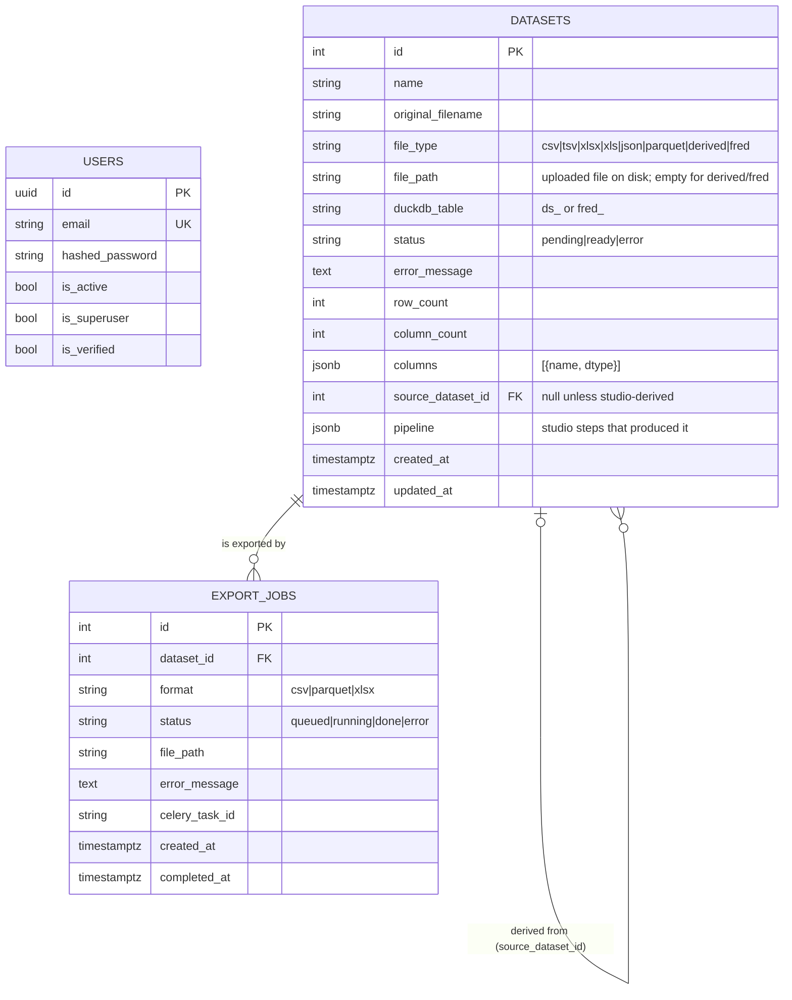

# Entity-relationship diagram

Postgres holds metadata; each `datasets` row points at a DuckDB table
(`duckdb_table`) where the actual rows live.

Notes:

- `users` is standalone for now — datasets are not yet owned per-user (single
  workspace). Adding an `owner_id` FK is the natural next migration.
- Deleting a dataset cascades its export jobs (`ondelete=CASCADE`) but only
  nulls `source_dataset_id` on derived datasets (`ondelete=SET NULL`), so
  derivations survive their source with provenance intact in `pipeline`.
- DuckDB tables are intentionally outside this diagram: their schema is
  per-dataset and recorded in `datasets.columns`.
